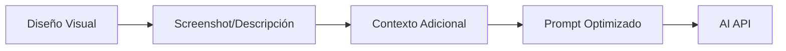

# 🎨 Protocolo: Visual a Código con AI

## Objetivo

Definir el protocolo estándar para traducir renders visuales a código HTML/CSS/JS usando Blackbox AI (o Claude 3).

---

## 🔄 Flujo del Protocolo

### Fase 1: Captura Visual



#### 1.1 Captura de Información Visual

**Métodos de Input:**
1. **Screenshot del Canvas** - Capturar diseño actual
2. **Descripción Textual** - Usuario describe en lenguaje natural
3. **Imagen Externa** - Subir diseño de Figma/Sketch
4. **Elemento Existente** - Mejorar componente del canvas

#### 1.2 Extracción de Contexto

```javascript
const visualContext = {
    // Información estructural
    layout: 'flexbox|grid|float',
    sections: ['header', 'main', 'footer'],
    components: ['navbar', 'hero', 'cards'],
    
    // Información de estilo
    colors: {
        primary: '#2563eb',
        secondary: '#64748b',
        background: '#ffffff'
    },
    typography: {
        headings: 'bold, large',
        body: 'regular, 16px'
    },
    spacing: 'generous|compact|balanced',
    
    // Información funcional
    interactive: ['buttons', 'forms', 'modals'],
    responsive: true,
    accessibility: 'WCAG 2.1 AA'
};
```

---

### Fase 2: Construcción de Prompt

#### 2.1 Template de Prompt Base

```javascript
const promptTemplate = `
[ROLE]
Eres un experto desarrollador web especializado en crear código limpio, semántico y production-ready.

[TASK]
Genera código HTML/CSS/JavaScript vanilla para:
{DESCRIPTION}

[CONTEXT]
Tipo de componente/página: {TYPE}
Framework: Vanilla JavaScript (no librerías)
Responsive: {RESPONSIVE}
Accesibilidad: {ACCESSIBILITY}
Estilo visual: {STYLE}

[REQUIREMENTS]
1. HTML5 semántico
2. CSS moderno (Flexbox/Grid)
3. Sin frameworks ni librerías externas
4. Responsive mobile-first
5. Accesible (ARIA labels, contrast ratios)
6. SEO optimizado (meta tags apropiados)
7. Performance optimizado (inline crítico, lazy load)
8. Código limpio y comentado

[OUTPUT_FORMAT]
\`\`\`html
[Código HTML aquí]
\`\`\`

\`\`\`css
[CSS separado aquí si aplica]
\`\`\`

\`\`\`javascript
[JavaScript aquí si aplica]
\`\`\`

[QUALITY_CHECKS]
- Validar HTML (no tags sin cerrar)
- Verificar accesibilidad (contrast >4.5:1)
- Asegurar responsive (mobile, tablet, desktop)
- Optimizar performance (crítico inline, diferir no-crítico)
`;
```

#### 2.2 Enriquecimiento de Prompt

**Agregar Contexto Específico:**

```javascript
function enrichPrompt(basePrompt, context) {
    let enriched = basePrompt;
    
    // Agregar colores específicos
    if (context.colors) {
        enriched += `\n\nPaleta de colores a usar:\n`;
        Object.entries(context.colors).forEach(([key, value]) => {
            enriched += `- ${key}: ${value}\n`;
        });
    }
    
    // Agregar dimensiones
    if (context.dimensions) {
        enriched += `\n\nDimensiones:\n`;
        enriched += `- Ancho: ${context.dimensions.width}\n`;
        enriched += `- Alto: ${context.dimensions.height}\n`;
    }
    
    // Agregar ejemplos similares
    if (context.examples) {
        enriched += `\n\nReferencias similares:\n${context.examples}\n`;
    }
    
    return enriched;
}
```

---

### Fase 3: Llamada a API

#### 3.1 Request Structure

```javascript
const apiRequest = {
    method: 'POST',
    url: 'https://api.blackbox.ai/v1/chat/completions',
    headers: {
        'Content-Type': 'application/json',
        'Authorization': `Bearer ${API_KEY}`
    },
    body: {
        model: 'blackbox', // o 'claude-3-sonnet'
        messages: [
            {
                role: 'system',
                content: 'System prompt con rol y contexto'
            },
            {
                role: 'user',
                content: 'Prompt enriquecido con descripción y reqs'
            }
        ],
        max_tokens: 4000,
        temperature: 0.7,
        stream: false
    }
};
```

#### 3.2 Manejo de Errores

```javascript
async function callWithRetry(apiCall, maxRetries = 3) {
    for (let i = 0; i < maxRetries; i++) {
        try {
            return await apiCall();
        } catch (error) {
            if (i === maxRetries - 1) throw error;
            
            // Esperar antes de reintentar (exponential backoff)
            await new Promise(resolve => 
                setTimeout(resolve, Math.pow(2, i) * 1000)
            );
        }
    }
}
```

---

### Fase 4: Procesamiento de Respuesta

#### 4.1 Parsing de Código

```javascript
function parseAIResponse(response) {
    const content = response.choices[0].message.content;
    
    // Extraer bloques de código
    const blocks = {
        html: extractCodeBlock(content, 'html'),
        css: extractCodeBlock(content, 'css'),
        js: extractCodeBlock(content, 'javascript')
    };
    
    return blocks;
}

function extractCodeBlock(text, language) {
    const regex = new RegExp(`\`\`\`${language}\\n([\\s\\S]*?)\`\`\``, 'g');
    const match = regex.exec(text);
    return match ? match[1].trim() : null;
}
```

#### 4.2 Validación de Código

```javascript
function validateGeneratedCode(code) {
    const issues = [];
    
    // Validar HTML
    if (code.html) {
        // Check unclosed tags
        const openTags = (code.html.match(/<[^/][^>]*>/g) || []).length;
        const closeTags = (code.html.match(/<\/[^>]*>/g) || []).length;
        
        if (openTags !== closeTags) {
            issues.push({
                type: 'html',
                severity: 'high',
                message: 'Tags no balanceados'
            });
        }
    }
    
    // Validar CSS
    if (code.css) {
        // Check balanced braces
        const openBraces = (code.css.match(/{/g) || []).length;
        const closeBraces = (code.css.match(/}/g) || []).length;
        
        if (openBraces !== closeBraces) {
            issues.push({
                type: 'css',
                severity: 'high',
                message: 'Braces no balanceados'
            });
        }
    }
    
    return {
        valid: issues.filter(i => i.severity === 'high').length === 0,
        issues: issues
    };
}
```

#### 4.3 Sanitización

```javascript
function sanitizeCode(code) {
    let clean = code;
    
    // Remover scripts potencialmente peligrosos
    clean = clean.replace(/<script[^>]*>[\s\S]*?<\/script>/gi, '');
    
    // Remover event handlers inline peligrosos
    clean = clean.replace(/on\w+\s*=\s*["'][^"']*["']/gi, '');
    
    // Remover iframes de orígenes no confiables
    clean = clean.replace(/<iframe[^>]*src=["'](?!https:\/\/(www\.)?youtube\.com|vimeo\.com)[^"']*["'][^>]*>/gi, '');
    
    return clean;
}
```

---

### Fase 5: Integración en Editor

#### 5.1 Conversión a Elemento Editable

```javascript
function integrateAICode(generatedCode) {
    // Crear elemento temporal
    const temp = document.createElement('div');
    temp.innerHTML = generatedCode.html;
    
    const element = temp.firstElementChild;
    
    if (!element) {
        throw new Error('No se pudo parsear el código generado');
    }
    
    // Preparar para el editor
    prepareForEditor(element);
    
    // Insertar en canvas
    const canvas = document.getElementById('canvas');
    canvas.appendChild(element);
    
    return element;
}

function prepareForEditor(element) {
    // Agregar ID único
    element.id = 'element-' + (window.elementIdCounter++);
    
    // Agregar clase del editor
    element.classList.add('canvas-element');
    element.setAttribute('data-component-type', 'ai-generated');
    
    // Agregar botón de delete
    const deleteBtn = document.createElement('div');
    deleteBtn.className = 'delete-btn';
    deleteBtn.textContent = '×';
    deleteBtn.onclick = (e) => {
        e.stopPropagation();
        window.deleteElement(element);
    };
    element.appendChild(deleteBtn);
    
    // Agregar eventos del editor
    element.addEventListener('click', (e) => {
        e.stopPropagation();
        window.selectElement(element);
    });
    
    element.addEventListener('dblclick', (e) => {
        e.stopPropagation();
        window.makeElementEditable(element);
    });
    
    // Drag & drop
    if (window.setupElementDragAndDrop) {
        window.setupElementDragAndDrop(element);
    }
}
```

---

## 🎯 Casos de Uso Específicos

### Caso 1: "Design to Code" - Screenshot a HTML

**Input:** Screenshot de diseño en Figma
**Proceso:**
1. Usuario sube imagen
2. AI analiza estructura visual
3. AI identifica componentes
4. AI genera HTML equivalente
5. Usuario revisa y ajusta

**Código:**
```javascript
// Capturar screenshot o subir imagen
const imageFile = await selectImageFile();
const imageData = await fileToBase64(imageFile);

// Generar código
const result = await window.aiCodeGenerator.generateFromImage(
    imageData,
    {
        framework: 'vanilla',
        responsive: true,
        style: 'modern'
    }
);

// Insertar en canvas
integrateAICode(result);
```

### Caso 2: "Prompt to Component" - Texto a Componente

**Input:** Descripción textual
**Proceso:**
1. Usuario describe componente
2. AI interpreta requerimientos
3. AI genera código optimizado
4. Usuario inserta en canvas

**Código:**
```javascript
const description = "Card de pricing con header morado, precio grande, lista de features con checkmarks verdes, botón 'Elegir Plan' blanco";

const component = await window.aiCodeGenerator.generateComponent(
    description,
    'pricing'
);

integrateAICode(component);
```

### Caso 3: "Refine Existing" - Mejorar Código

**Input:** Elemento existente + instrucción
**Proceso:**
1. Usuario selecciona elemento
2. Usuario da instrucción de mejora
3. AI modifica manteniendo estructura
4. Usuario compara y aplica

**Código:**
```javascript
const selected = window.selectedElement;

const improved = await window.aiCodeGenerator.modifyElement(
    selected,
    'Hacer más minimalista, reducir espaciado, usar colores pastel'
);

// Reemplazar elemento
selected.outerHTML = improved.html;
```

### Caso 4: "Canvas Cleanup" - Optimizar Todo

**Input:** Canvas completo
**Proceso:**
1. AI analiza todo el canvas
2. Limpia elementos del editor
3. Optimiza código
4. Extrae CSS
5. Genera HTML production-ready

**Código:**
```javascript
const clean = await window.aiCodeGenerator.canvasToCode();

// Descargar como archivo limpio
downloadFile('index.html', clean.html);
if (clean.css) {
    downloadFile('styles.css', clean.css);
}
```

---

## 📐 Prompts Optimizados por Tipo

### Navbar
```
Modelo de prompt para navbar efectivo:

"Navbar {estilo} con:
- Logo: {posición} - {descripción}
- Navegación: {items} - {posición}
- CTA: {texto} - {estilo} - {posición}
- Altura: {Xpx}
- Sticky: {sí/no}
- Colores: {esquema}
- Mobile: {hamburger menu/otro}"

Ejemplo:
"Navbar moderno con logo 'TechCorp' izquierda, menú centrado (Home, Products, Pricing, Contact), botón 'Get Started' azul derecha, altura 80px, sticky, fondo blanco semi-transparente, hamburger menu en mobile"
```

### Hero Section
```
"Hero {estilo} con:
- Layout: {column/row} - {distribución}
- Título: {texto/placeholder} - {tamaño} - {color}
- Subtítulo: {texto/placeholder}
- CTAs: {número} - {textos} - {estilos}
- Visual: {imagen/video/ilustración} - {posición}
- Altura: {vh/px}
- Background: {color/gradiente/imagen}
- Alineación: {left/center/right}"

Ejemplo:
"Hero centrado con gradiente azul-morado, título blanco 'Build Faster', subtítulo, dos botones (Primario 'Start Free', Secundario 'Watch Demo'), mockup de producto derecha, altura 80vh, centrado vertical"
```

### Card/Component
```
"Card {tipo} con:
- Estructura: {imagen arriba/izquierda/fondo}
- Contenido: {título, descripción, precio, etc}
- CTAs: {botones/links}
- Dimensiones: {ancho} x {alto}
- Estilo: {sombra/borde/elevación}
- Hover: {efecto}
- Colores: {esquema}"

Ejemplo:
"Card de producto con imagen arriba 16:9, título producto, descripción 2 líneas, precio destacado rojo, botón 'Add to Cart' azul full-width, ancho 320px, sombra sutil, elevación al hover, bordes redondeados 12px"
```

---

## 🔧 Configuración del Endpoint

### Setup con Blackbox AI

```javascript
// Configuración básica
const config = {
    endpoint: 'https://api.blackbox.ai/v1/chat/completions',
    apiKey: 'sk-your-api-key',
    model: 'blackbox',
    maxTokens: 4000,
    temperature: 0.7
};

// Inicializar
window.aiCodeGenerator = new AICodeGenerator();
window.aiCodeGenerator.saveApiKey(config.apiKey);
window.aiCodeGenerator.model = config.model;
```

### Setup con Claude 3 (Futuro)

```javascript
// Cuando Claude 3 esté disponible vía Blackbox
const config = {
    endpoint: 'https://api.blackbox.ai/v1/chat/completions',
    apiKey: 'sk-your-api-key',
    model: 'claude-3-sonnet',
    maxTokens: 8000,
    temperature: 0.7
};

window.aiCodeGenerator.model = 'claude-3-sonnet';
```

---

## 📊 Métricas de Calidad

### Evaluación Automática de Código Generado

```javascript
async function evaluateGeneratedCode(code) {
    const metrics = {
        // Validez
        htmlValid: validateHTML(code.html),
        cssValid: validateCSS(code.css),
        
        // Accesibilidad
        hasAltTexts: checkAltTexts(code.html),
        hasAriaLabels: checkAriaLabels(code.html),
        colorContrast: await checkContrast(code.html),
        
        // SEO
        hasMetaTags: checkMetaTags(code.html),
        hasSemanticHTML: checkSemantic(code.html),
        
        // Performance
        inlineCSS: code.css === null, // CSS inline es más rápido para componentes
        imageOptimized: checkImages(code.html),
        
        // Best Practices
        noInlineJS: !code.html.includes('onclick='),
        noEmptyTags: !code.html.includes('></')
    };
    
    // Calcular score
    const score = Object.values(metrics).filter(Boolean).length / Object.keys(metrics).length * 100;
    
    return {
        score: score,
        metrics: metrics,
        passed: score >= 80
    };
}
```

---

## 🎨 Ejemplos de Traducción

### Ejemplo 1: Simple Description → Component

**Input (Usuario):**
```
"Botón primario azul, texto blanco, padding generoso, border radius, hover más oscuro"
```

**Prompt Generado:**
```
Genera un botón en HTML/CSS vanilla:
- Color: Azul (#2563eb)
- Texto: Blanco
- Padding: 12px 24px
- Border radius: 6px
- Hover: Azul más oscuro (#1d4ed8)
- Cursor: pointer
- Transición suave

Retorna solo el código.
```

**Output (AI):**
```html
<button style="
    background: #2563eb;
    color: white;
    padding: 12px 24px;
    border: none;
    border-radius: 6px;
    cursor: pointer;
    font-weight: 500;
    transition: background 0.3s ease;
" onmouseover="this.style.background='#1d4ed8'" onmouseout="this.style.background='#2563eb'">
    Click Me
</button>
```

**Post-Procesamiento:**
```javascript
// Limpiar inline handlers
const clean = removeInlineHandlers(output);

// Extraer a CSS
const extracted = extractToCSS(clean);

// Resultado final: HTML limpio + CSS separado
```

### Ejemplo 2: Screenshot → Full Section

**Input:** Screenshot de hero section de Figma

**Análisis AI:**
```
- Layout: 2 columnas (60/40)
- Left: Título, subtítulo, 2 botones vertical
- Right: Imagen de producto
- Background: Gradiente azul-morado
- Altura: ~600px
- Responsive: Stack en mobile
```

**Código Generado:**
```html
<section style="
    min-height: 600px;
    background: linear-gradient(135deg, #667eea 0%, #764ba2 100%);
    display: grid;
    grid-template-columns: 60% 40%;
    align-items: center;
    padding: 60px 40px;
    gap: 40px;
">
    <div style="color: white;">
        <h1 style="font-size: 56px; font-weight: bold; margin-bottom: 20px;">
            Build Faster
        </h1>
        <p style="font-size: 20px; margin-bottom: 40px; opacity: 0.9;">
            The tool you need to ship products faster
        </p>
        <div style="display: flex; gap: 20px;">
            <button style="...">Start Free</button>
            <button style="...">Watch Demo</button>
        </div>
    </div>
    <div>
        
    </div>
</section>

<style>
@media (max-width: 768px) {
    section {
        grid-template-columns: 1fr;
        text-align: center;
    }
}
</style>
```

---

## 🔄 Feedback Loop

### Iteración con AI

```javascript
// 1. Generar inicial
let code = await generate(description);

// 2. Usuario revisa
// "Se ve bien pero muy grande"

// 3. Refinar
code = await improve(code, "Reducir tamaños de fuente 20%");

// 4. Usuario revisa
// "Perfecto pero cambiar color a verde"

// 5. Ajustar
code = await improve(code, "Cambiar azul por verde #10b981");

// 6. Final
return code;
```

### Aprendizaje Continuo

```javascript
// Guardar pares (description → code) exitosos
const successfulGenerations = {
    prompt: description,
    code: generatedCode,
    rating: userRating,
    timestamp: Date.now()
};

// Usar en futuras generaciones como ejemplos
```

---

## 📊 KPIs del Sistema

### Métricas de Calidad
- **Validez del código:** >95% HTML/CSS válido
- **Accessibility score:** >90 (Lighthouse)
- **First attempt success:** >70% usable sin modificaciones
- **Time saved:** 5-10x vs escribir manualmente

### Métricas de Uso
- **Generaciones/día:** Track
- **Success rate:** % generaciones insertadas vs descartadas
- **Tipo más usado:** Qué componentes se generan más
- **Refinement iterations:** Promedio de iteraciones hasta satisfacción

---

## 🚀 Optimizaciones

### Caching de Prompts Comunes

```javascript
const promptCache = {
    'navbar-modern': 'Navbar moderno con logo izq, menú centro, CTA derecha...',
    'hero-gradient': 'Hero con gradiente, título grande, 2 botones...',
    'card-product': 'Card producto con imagen, título, precio, CTA...'
};

// Usar cache para respuestas más rápidas
function getCachedPrompt(type) {
    return promptCache[type] || null;
}
```

### Batch Generation

```javascript
// Generar múltiples componentes en una sola llamada
async function generateBatch(descriptions) {
    const prompt = `Genera estos ${descriptions.length} componentes:

${descriptions.map((d, i) => `${i + 1}. ${d}`).join('\n')}

Retorna cada componente separado por "---COMPONENT---".`;

    const response = await callAPI(prompt);
    return response.split('---COMPONENT---').map(cleanCode);
}
```

---

## ✅ Checklist de Implementación

### Backend/API
- [x] AICodeGenerator class creada
- [x] Integración con Blackbox API
- [x] Manejo de errores
- [x] Retry logic
- [ ] Rate limiting (futuro)
- [ ] Caching (futuro)

### Frontend/UI
- [x] Config dialog
- [x] Generate dialog
- [x] Botones en toolbar
- [x] Toast notifications
- [ ] Progress indicators (mejora)
- [ ] Preview before insert (mejora)

### Procesamiento
- [x] Prompt templates
- [x] Response parsing
- [x] Code validation
- [x] Sanitization
- [x] Integration en editor

### Documentación
- [x] API reference
- [x] Uso examples
- [x] Best practices
- [x] Protocol documentation

---

## 🎉 Resumen

**Protocolo Completo Implementado:**

✅ Sistema de generación de código con AI
✅ Múltiples métodos de input (text, image, element)
✅ Prompt optimization automático
✅ Parsing y validación de respuestas
✅ Integración seamless con editor
✅ UI configuración y generación
✅ Documentación completa

**Próximos Pasos:**
1. Obtener Blackbox API key
2. Configurar en editor (⚙️ AI Config)
3. Probar generación de componentes
4. Iterar y mejorar prompts

---

*Protocolo versión: 1.0*
*Compatible con: Blackbox AI, Claude 3 (futuro), GPT-4 (futuro)*
*Última actualización: 29 de Noviembre, 2025*
