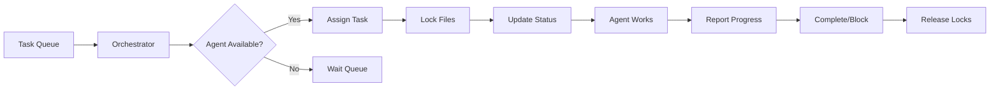

# 🎯 Sistema de Orquestación Central - DragNDrop v3.3

**Fecha de Inicio**: Diciembre 2025  
**Sistema**: Orquestación Multi-Agente con Prevención de Colisiones  
**Estado**: 🟢 ACTIVO

---

## 📋 Tabla de Control Principal

| Agente | Estado | Tarea Actual | Progreso | Última Actualización | Archivos Bloqueados |
|--------|---------|--------------|----------|---------------------|---------------------|
| @dev | 🟢 IDLE | - | - | - | - |
| @test | 🟢 IDLE | - | - | - | - |
| @qa | 🟢 IDLE | - | - | - | - |
| @docs | 🟢 IDLE | - | - | - | - |
| @devops | 🟢 IDLE | - | - | - | - |

---

## 🏗️ Arquitectura del Sistema

```
orchestration/
├── ORCHESTRATOR.md          # Este archivo - Control central
├── LOCK_REGISTRY.md         # Registro de archivos bloqueados
├── TASK_QUEUE.md           # Cola de tareas pendientes
├── agents/                 # Configuración por agente
│   ├── dev/
│   │   ├── CONFIG.md      # Configuración del agente
│   │   ├── CURRENT.md     # Tarea actual
│   │   └── HISTORY.md     # Historial de tareas
│   ├── test/
│   ├── qa/
│   ├── docs/
│   └── devops/
├── reports/               # Reportes consolidados
│   ├── daily/
│   ├── weekly/
│   └── agents/
├── tasks/                # Sistema unificado de tareas
│   ├── queue/           # Tareas esperando asignación
│   ├── active/          # Tareas en progreso
│   ├── completed/       # Tareas completadas
│   └── blocked/         # Tareas bloqueadas
├── status/              # Estados y métricas
│   └── METRICS.md      # Métricas en tiempo real
└── logs/               # Logs de comunicación
    └── agent_logs/     # Logs por agente
```

---

## 🔄 Flujo de Trabajo

### 1. Asignación de Tareas



### 2. Prevención de Colisiones

**Sistema de Bloqueo de Archivos**:
1. Antes de asignar tarea, verificar `LOCK_REGISTRY.md`
2. Bloquear todos los archivos que el agente modificará
3. Otros agentes no pueden tocar archivos bloqueados
4. Al completar, liberar bloqueos

**Ejemplo de Bloqueo**:
```markdown
## Archivos Bloqueados

| Archivo | Agente | Tarea | Desde | Hasta |
|---------|--------|-------|-------|-------|
| /src/core/themeManager.js | @test | TASK-003 | 2025-12-09 10:00 | - |
| /tests/unit/themeManager.test.js | @test | TASK-003 | 2025-12-09 10:00 | - |
```

---

## 📝 Comunicación Inter-Agente

### Protocolo de Mensajería

Los agentes se comunican a través de archivos en sus directorios:

1. **REQUEST**: `agents/{agent}/inbox/REQUEST_{id}.md`
2. **RESPONSE**: `agents/{agent}/outbox/RESPONSE_{id}.md`
3. **STATUS**: `agents/{agent}/STATUS.md`

### Formato de Mensaje

```markdown
---
from: @dev
to: @test
timestamp: 2025-12-09T10:00:00Z
type: REQUEST|RESPONSE|STATUS
priority: HIGH|MEDIUM|LOW
---

## Subject: Necesito tests para themeManager

### Context
He completado la implementación de...

### Request
Por favor crear tests unitarios para...

### Files Modified
- /src/core/themeManager.js
- /src/styles/themes.css
```

---

## 🎯 Tareas Prioritarias

### Cola Inmediata (Próximas 48h)

| ID | Tarea | Prioridad | Estimación | Agente Sugerido | Dependencias |
|----|-------|-----------|------------|-----------------|--------------|
| TASK-001 | Landing Page Implementation | 🔴 CRÍTICA | 8h | @dev | - |
| TASK-002 | Fix 38 Failing Tests | 🔴 CRÍTICA | 4h | @test | - |
| TASK-003 | Complete Dark Theme Tests | 🟠 ALTA | 2h | @test | - |
| TASK-004 | Unify Task Management | 🟠 ALTA | 3h | @docs | - |
| TASK-005 | Document Hidden Features | 🟡 MEDIA | 4h | @docs | - |

### Backlog (Próxima Semana)

| ID | Tarea | Prioridad | Estimación | Agente Sugerido |
|----|-------|-----------|------------|-----------------|
| TASK-006 | Implement Layer System | 🟡 MEDIA | 4d | @dev |
| TASK-007 | Multi-select Feature | 🟡 MEDIA | 5d | @dev |
| TASK-008 | Expand Test Coverage 80% | 🟡 MEDIA | 5d | @test |
| TASK-009 | Deploy to Production | 🟢 BAJA | 2h | @devops |
| TASK-010 | Setup CI/CD Pipeline | 🟢 BAJA | 4h | @devops |

---

## 📊 Métricas en Tiempo Real

### Performance Global
- **Tareas Completadas**: 0/10
- **Velocidad**: 0 tareas/día
- **Bloqueos Actuales**: 0
- **Agentes Activos**: 0/5

### Por Agente
| Agente | Tareas | Completadas | Bloqueadas | Eficiencia |
|--------|---------|-------------|------------|------------|
| @dev | 0 | 0 | 0 | - |
| @test | 0 | 0 | 0 | - |
| @qa | 0 | 0 | 0 | - |
| @docs | 0 | 0 | 0 | - |
| @devops | 0 | 0 | 0 | - |

---

## 🚦 Reglas de Orquestación

### 1. Asignación de Tareas
- Verificar disponibilidad del agente
- Verificar no conflictos de archivos
- Respetar prioridades (🔴 > 🟠 > 🟡 > 🟢)
- Balancear carga entre agentes

### 2. Gestión de Bloqueos
- Un archivo = un agente a la vez
- Bloqueos máximo 24h (auto-release)
- Directorios completos pueden bloquearse
- Sistema de prioridad para desbloqueos

### 3. Resolución de Conflictos
- Si dos agentes necesitan mismo archivo:
  - Prioridad más alta gana
  - Otro agente espera o busca tarea alternativa
- Deadlocks se resuelven por antigüedad de tarea

### 4. Reportes Obligatorios
- Cada 2 horas: STATUS update
- Al completar: REPORT completo
- Si bloqueado: BLOCK notification
- Diario: SUMMARY por agente

---

## 🔐 Sistema de Versionado

Para evitar conflictos en archivos compartidos:

```
archivo.js          # Versión actual
archivo.js.agent    # Copia de trabajo del agente
archivo.js.backup   # Backup antes de cambios
```

Al finalizar:
1. Merge cambios si no hay conflictos
2. Si hay conflictos, crear `archivo.js.conflict`
3. Notificar al orchestrator para resolución

---

## 📞 Comandos de Control

### Para el Orchestrator

```bash
# Asignar tarea a agente
./orchestration/assign-task.sh TASK-001 @dev

# Verificar estado global
./orchestration/status.sh

# Liberar bloqueos de agente
./orchestration/release-locks.sh @dev

# Generar reporte
./orchestration/generate-report.sh daily
```

### Para los Agentes

```bash
# Reportar progreso
./orchestration/agents/report-progress.sh 50

# Solicitar archivos
./orchestration/agents/request-lock.sh /src/core/file.js

# Completar tarea
./orchestration/agents/complete-task.sh TASK-001
```

---

## 📅 Próximas Acciones

1. **Activar Agentes** ✅
2. **Asignar Primera Ronda**:
   - @dev → TASK-001 (Landing Page)
   - @test → TASK-002 (Fix Tests)
   - @docs → TASK-004 (Unify Tasks)
3. **Monitorear Progreso**
4. **Ajustar Asignaciones**

---

## 🔄 Actualizaciones

Este archivo se actualiza cada 2 horas automáticamente.

**Última actualización**: 2025-12-09T10:00:00Z  
**Próxima actualización**: 2025-12-09T12:00:00Z

---

**Sistema de Orquestación v1.0** - Diseñado para máxima eficiencia y cero colisiones