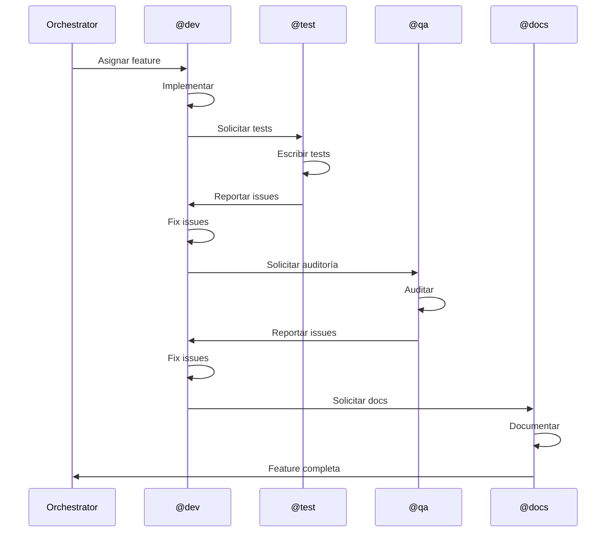
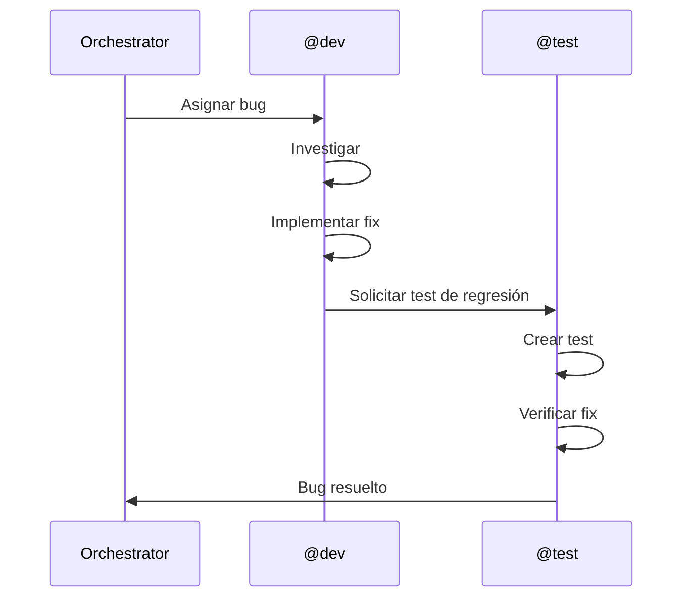

# 🤖 Roles y Responsabilidades de Agentes

**Versión**: 1.0  
**Última Actualización**: 2025-12-10  
**Estado**: 🟢 ACTIVO

---

## 📖 Tabla de Contenidos

1. [Visión General](#-visión-general)
2. [Agentes del Sistema](#-agentes-del-sistema)
3. [Matriz de Responsabilidades](#-matriz-de-responsabilidades)
4. [Guías por Agente](#-guías-por-agente)
5. [Interacciones Entre Agentes](#-interacciones-entre-agentes)
6. [Escalamiento y Resolución](#-escalamiento-y-resolución)

---

## 🎯 Visión General

El sistema de orquestación de DragNDrop utiliza **5 agentes especializados** coordinados por un **Orchestrator central**. Cada agente tiene un rol específico, capacidades definidas y responsabilidades claras.

### Arquitectura de Agentes

```
                    ┌─────────────────┐
                    │   ORCHESTRATOR  │
                    │   (Coordinador) │
                    └────────┬────────┘
                             │
        ┌────────────────────┼────────────────────┐
        │                    │                    │
   ┌────┴────┐         ┌─────┴─────┐        ┌────┴────┐
   │  @dev   │         │   @test   │        │  @docs  │
   │ (Code)  │         │ (Testing) │        │ (Docs)  │
   └─────────┘         └───────────┘        └─────────┘
        │                    │                    │
   ┌────┴────┐         ┌─────┴─────┐
   │   @qa   │         │  @devops  │
   │(Quality)│         │  (Infra)  │
   └─────────┘         └───────────┘
```

---

## 👥 Agentes del Sistema

### Resumen de Agentes

| Agente | Rol | Modelo AI | Especialización |
|--------|-----|-----------|-----------------|
| **@dev** | Desarrollador | Claude 3.5 Sonnet | Frontend, JavaScript, UI |
| **@test** | Tester | Claude 3 Opus | Unit tests, E2E, Coverage |
| **@docs** | Documentador | GPT-4 Turbo | Documentación técnica |
| **@qa** | Quality Assurance | GPT-4 | Accessibility, Performance |
| **@devops** | DevOps | Claude 3.5 Sonnet | CI/CD, Deployment, Infra |

---

## 📊 Matriz de Responsabilidades

### RACI Matrix

| Actividad | @dev | @test | @docs | @qa | @devops |
|-----------|------|-------|-------|-----|---------|
| **Implementar features** | R | C | I | C | I |
| **Escribir unit tests** | C | R | I | C | I |
| **Escribir E2E tests** | C | R | I | C | I |
| **Documentar código** | R | I | C | I | I |
| **Documentar usuario** | C | I | R | C | I |
| **Auditar accesibilidad** | I | I | I | R | I |
| **Auditar performance** | C | I | I | R | C |
| **Configurar CI/CD** | I | C | I | I | R |
| **Deploy a producción** | I | I | I | I | R |
| **Fix bugs** | R | C | I | C | I |
| **Code review** | R | C | I | C | I |

**Leyenda**: R = Responsable, A = Accountable, C = Consultado, I = Informado

---

## 📋 Guías por Agente

### 🔧 @dev - Agente de Desarrollo

#### Perfil

```json
{
  "model": "claude-3-5-sonnet-20241022",
  "temperature": 0.2,
  "max_tokens": 8192,
  "specialization": "Frontend Development"
}
```

#### Responsabilidades Principales

1. **Implementación de Features**
   - Desarrollar nuevas funcionalidades
   - Seguir arquitectura existente
   - Escribir código limpio y documentado
   - Implementar UI/UX según especificaciones

2. **Corrección de Bugs**
   - Investigar root cause
   - Implementar fix
   - Agregar test de regresión
   - Documentar solución

3. **Refactoring**
   - Mejorar código existente
   - Optimizar performance
   - Reducir deuda técnica
   - Mantener compatibilidad

#### Archivos Típicos

```
src/
├── core/           # Módulos principales
├── components/     # Componentes UI
├── utils/          # Utilidades
├── styles/         # CSS
└── storage/        # Persistencia
```

#### Checklist de Entrega

- [ ] Código implementado según spec
- [ ] JSDoc completo en funciones públicas
- [ ] Sin console.logs ni TODOs
- [ ] Estilos consistentes con proyecto
- [ ] Funciona en todos los browsers target
- [ ] No rompe funcionalidad existente

#### Comunicación

**Solicita a**:
- @test: Tests para nuevo código
- @docs: Documentación de features
- @qa: Revisión de accesibilidad

**Recibe de**:
- @test: Reportes de bugs encontrados
- @qa: Issues de accesibilidad/performance

---

### 🧪 @test - Agente de Testing

#### Perfil

```json
{
  "model": "claude-3-opus-20240229",
  "temperature": 0.1,
  "max_tokens": 4096,
  "specialization": "Quality Assurance Testing"
}
```

#### Responsabilidades Principales

1. **Unit Testing**
   - Escribir tests unitarios con Jest
   - Alcanzar >80% coverage
   - Cubrir edge cases
   - Mantener tests rápidos (<5s total)

2. **E2E Testing**
   - Escribir tests con Playwright
   - Cubrir flujos críticos de usuario
   - Tests en múltiples browsers
   - Tests en dispositivos móviles

3. **Regression Testing**
   - Crear tests para bugs reportados
   - Verificar fixes no introducen regresiones
   - Mantener suite de regresión

#### Archivos Típicos

```
tests/
├── unit/           # Tests unitarios
│   ├── core/
│   ├── components/
│   └── utils/
├── e2e/            # Tests end-to-end
├── fixtures/       # Datos de prueba
└── mocks/          # Mocks y stubs
```

#### Checklist de Entrega

- [ ] Tests descriptivos y claros
- [ ] Happy paths cubiertos
- [ ] Edge cases cubiertos
- [ ] Error scenarios cubiertos
- [ ] Mocks usados apropiadamente
- [ ] Sin tests flaky
- [ ] Coverage >80%

#### Comunicación

**Solicita a**:
- @dev: Clarificación de comportamiento esperado
- @docs: Documentación de APIs para testing

**Recibe de**:
- @dev: Código nuevo para testear
- @qa: Casos de prueba adicionales

---

### 📚 @docs - Agente de Documentación

#### Perfil

```json
{
  "model": "gpt-4-0125-preview",
  "temperature": 0.5,
  "max_tokens": 8192,
  "specialization": "Technical Documentation"
}
```

#### Responsabilidades Principales

1. **Documentación de Usuario**
   - Guías de inicio rápido
   - Tutoriales paso a paso
   - FAQ y troubleshooting
   - Documentación de features

2. **Documentación Técnica**
   - API reference
   - Arquitectura del sistema
   - Guías de contribución
   - Documentación de código

3. **Mantenimiento**
   - Actualizar docs con cambios
   - Verificar links y ejemplos
   - Mantener consistencia
   - Generar changelogs

#### Archivos Típicos

```
docs/
├── user/           # Documentación de usuario
├── technical/      # Documentación técnica
├── api/            # API reference
└── guides/         # Guías y tutoriales

# Archivos raíz
README.md
CHANGELOG.md
CONTRIBUTING.md
```

#### Checklist de Entrega

- [ ] Markdown bien formateado
- [ ] Ejemplos de código funcionales
- [ ] Screenshots actualizados
- [ ] Links verificados
- [ ] Tabla de contenidos si >500 líneas
- [ ] Consistente con estilo del proyecto

#### Comunicación

**Solicita a**:
- @dev: Detalles técnicos de implementación
- @test: Información sobre testing
- @qa: Guías de accesibilidad

**Recibe de**:
- @dev: Features nuevas para documentar
- @qa: Correcciones de accesibilidad en docs

---

### ♿ @qa - Agente de Quality Assurance

#### Perfil

```json
{
  "model": "gpt-4",
  "temperature": 0.3,
  "max_tokens": 4096,
  "specialization": "Quality Assurance & Accessibility"
}
```

#### Responsabilidades Principales

1. **Auditoría de Accesibilidad**
   - Verificar WCAG 2.1 AA compliance
   - Revisar contraste de colores
   - Verificar navegación por teclado
   - Probar con screen readers

2. **Auditoría de Performance**
   - Medir Core Web Vitals
   - Identificar bottlenecks
   - Recomendar optimizaciones
   - Verificar Lighthouse scores

3. **Revisión de UX**
   - Evaluar usabilidad
   - Identificar friction points
   - Proponer mejoras
   - Verificar consistencia

#### Archivos Típicos

```
reports/
├── accessibility/  # Reportes de accesibilidad
├── performance/    # Reportes de performance
└── ux/            # Reportes de UX

qa/
├── checklists/    # Checklists de QA
└── audits/        # Auditorías completas
```

#### Checklist de Entrega

- [ ] Auditoría completa realizada
- [ ] Issues categorizados por severidad
- [ ] Recomendaciones claras
- [ ] Screenshots/evidencia incluida
- [ ] Métricas documentadas
- [ ] Plan de remediación propuesto

#### Comunicación

**Solicita a**:
- @dev: Fixes para issues encontrados
- @docs: Actualización de guías de accesibilidad

**Recibe de**:
- @dev: Código para auditar
- @test: Resultados de tests automatizados

---

### 🚀 @devops - Agente de DevOps

#### Perfil

```json
{
  "model": "claude-3-5-sonnet-20241022",
  "temperature": 0.1,
  "max_tokens": 4096,
  "specialization": "DevOps & Infrastructure"
}
```

#### Responsabilidades Principales

1. **CI/CD**
   - Configurar GitHub Actions
   - Automatizar builds y tests
   - Configurar deployments
   - Gestionar secrets

2. **Infraestructura**
   - Configurar hosting (Vercel/Cloudflare)
   - Gestionar dominios y SSL
   - Configurar CDN
   - Monitoreo y alertas

3. **Seguridad**
   - Implementar CSP
   - Configurar WAF
   - Gestionar secrets
   - Auditorías de seguridad

#### Archivos Típicos

```
.github/
├── workflows/      # GitHub Actions
└── CODEOWNERS

terraform/          # Infrastructure as Code
├── modules/
└── environments/

config/
├── vercel.json
└── cloudflare/
```

#### Checklist de Entrega

- [ ] Pipeline funcionando
- [ ] Tests pasando en CI
- [ ] Deploy exitoso
- [ ] Monitoreo configurado
- [ ] Secrets seguros
- [ ] Documentación actualizada

#### Comunicación

**Solicita a**:
- @dev: Requisitos de build
- @test: Tests para CI

**Recibe de**:
- @dev: Código para deploy
- @qa: Requisitos de performance

---

## 🔄 Interacciones Entre Agentes

### Flujos Comunes

#### Nueva Feature



#### Bug Fix



### Protocolo de Handoff

1. **Completar trabajo propio**
2. **Documentar estado actual**
3. **Crear mensaje en inbox del siguiente agente**
4. **Actualizar ORCHESTRATOR.md**
5. **Liberar bloqueos si aplica**

---

## 🚨 Escalamiento y Resolución

### Niveles de Escalamiento

| Nivel | Situación | Acción |
|-------|-----------|--------|
| **1** | Duda técnica | Consultar documentación |
| **2** | Bloqueo menor | Comunicar a agente relacionado |
| **3** | Bloqueo mayor | Notificar a Orchestrator |
| **4** | Conflicto crítico | Orchestrator interviene |

### Proceso de Escalamiento

```markdown
## Escalamiento

**De**: @agent
**Nivel**: 3
**Timestamp**: ISO-8601

### Situación
[Descripción del problema]

### Impacto
[Qué está bloqueado]

### Intentos de Resolución
1. [Qué se intentó]
2. [Resultado]

### Solicitud
[Qué se necesita del Orchestrator]
```

### Resolución de Conflictos

1. **Conflicto de prioridades**: Orchestrator decide
2. **Conflicto de archivos**: Sistema de bloqueos
3. **Conflicto de criterio**: Documentar ambas posiciones, Orchestrator decide
4. **Deadlock**: Orchestrator fuerza resolución

---

## 📈 Métricas por Agente

### KPIs Individuales

| Agente | Métrica Principal | Target |
|--------|-------------------|--------|
| @dev | Features completadas/semana | 3-5 |
| @test | Coverage % | >80% |
| @docs | Docs actualizadas | 100% |
| @qa | Issues encontrados/auditoría | 5-10 |
| @devops | Uptime % | >99.9% |

### Dashboard de Agentes

Ubicación: `orchestration/ORCHESTRATOR.md`

```markdown
| Agente | Estado | Tarea Actual | Progreso | Última Actualización |
|--------|--------|--------------|----------|---------------------|
| @dev | 🟢 WORKING | TASK-006 | 45% | 2025-12-10 14:00 |
| @test | 🟡 BLOCKED | TASK-002 | 80% | 2025-12-10 13:30 |
| @docs | 🟢 IDLE | - | - | 2025-12-10 12:00 |
| @qa | 🟢 WORKING | TASK-QA-001 | 30% | 2025-12-10 14:15 |
| @devops | 🟢 IDLE | - | - | 2025-12-10 11:00 |
```

---

## 🔗 Referencias

- [TASK_WORKFLOW.md](./TASK_WORKFLOW.md) - Flujo de trabajo de tareas
- [NAMING_CONVENTIONS.md](./NAMING_CONVENTIONS.md) - Convenciones de nomenclatura
- [BEST_PRACTICES.md](./BEST_PRACTICES.md) - Mejores prácticas
- [AGENT_MODEL_CONFIG.md](../AGENT_MODEL_CONFIG.md) - Configuración de modelos AI
- [COMMUNICATION_PROTOCOL.md](../COMMUNICATION_PROTOCOL.md) - Protocolo de comunicación

---

**Sistema de Orquestación v1.0** - Agentes especializados trabajando en armonía
