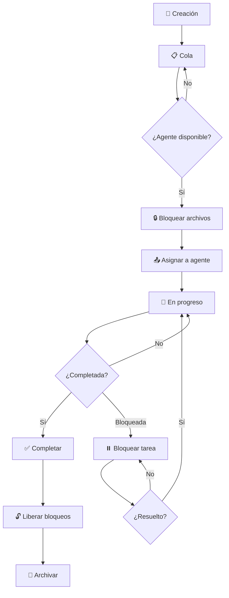
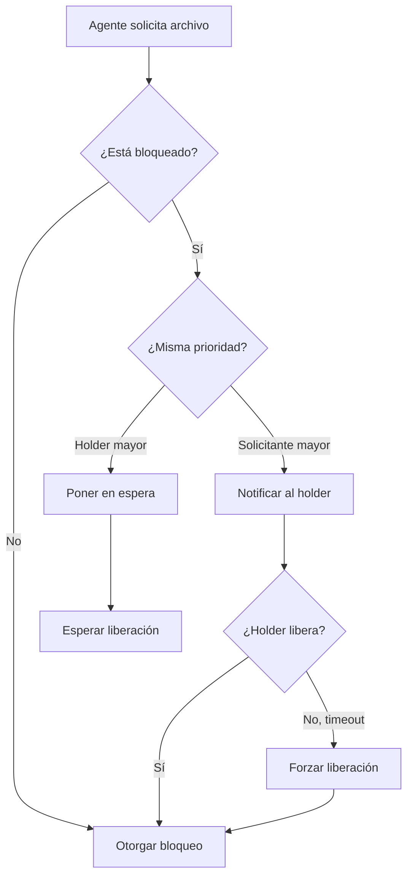

# 📋 Flujo de Trabajo de Tareas

**Versión**: 1.0  
**Última Actualización**: 2025-12-10  
**Estado**: 🟢 ACTIVO

---

## 📖 Tabla de Contenidos

1. [Visión General](#-visión-general)
2. [Ciclo de Vida de una Tarea](#-ciclo-de-vida-de-una-tarea)
3. [Estados de Tareas](#-estados-de-tareas)
4. [Flujo de Asignación](#-flujo-de-asignación)
5. [Sistema de Bloqueos](#-sistema-de-bloqueos)
6. [Reportes y Comunicación](#-reportes-y-comunicación)
7. [Resolución de Conflictos](#-resolución-de-conflictos)
8. [Comandos Útiles](#-comandos-útiles)

---

## 🎯 Visión General

El sistema de gestión de tareas de DragNDrop utiliza un modelo de **orquestación centralizada** con **prevención de colisiones** para coordinar el trabajo de múltiples agentes AI de forma eficiente.

### Principios Fundamentales

1. **Una única fuente de verdad**: Todas las tareas se gestionan desde `/orchestration/`
2. **Prevención de colisiones**: Sistema de bloqueos para evitar conflictos de archivos
3. **Comunicación asíncrona**: Mediante archivos markdown estructurados
4. **Trazabilidad completa**: Historial de todas las acciones y decisiones

### Estructura del Sistema

```
orchestration/
├── ORCHESTRATOR.md          # Control central y estado de agentes
├── TASK_QUEUE.md            # Cola unificada de tareas
├── LOCK_REGISTRY.md         # Registro de archivos bloqueados
├── COMMUNICATION_PROTOCOL.md # Protocolo de comunicación
│
├── tasks/                   # Sistema de tareas
│   ├── queue/              # Tareas esperando asignación
│   ├── active/             # Tareas en progreso
│   ├── completed/          # Tareas completadas
│   └── blocked/            # Tareas bloqueadas
│
├── agents/                  # Configuración por agente
│   ├── dev/
│   ├── test/
│   ├── qa/
│   ├── docs/
│   └── devops/
│
└── docs/                    # Documentación (este directorio)
    ├── TASK_WORKFLOW.md     # Este archivo
    ├── AGENT_ROLES.md
    ├── NAMING_CONVENTIONS.md
    └── BEST_PRACTICES.md
```

---

## 🔄 Ciclo de Vida de una Tarea



### Fases Detalladas

#### 1. 📝 Creación de Tarea

**Responsable**: Orchestrator o Usuario

**Acciones**:
1. Crear archivo de tarea usando template apropiado
2. Definir prioridad, estimación y agente sugerido
3. Identificar archivos que serán modificados
4. Agregar a `TASK_QUEUE.md`

**Ubicación**: `/orchestration/tasks/queue/TASK-XXX.md`

#### 2. 📋 En Cola

**Estado**: Esperando asignación

**Criterios para salir de cola**:
- Agente sugerido disponible
- Archivos necesarios no bloqueados
- Dependencias completadas

#### 3. 🔒 Bloqueo de Archivos

**Responsable**: Orchestrator

**Acciones**:
1. Verificar disponibilidad de archivos en `LOCK_REGISTRY.md`
2. Registrar bloqueos con timestamp y agente
3. Notificar a otros agentes si hay conflictos

#### 4. 📤 Asignación

**Responsable**: Orchestrator

**Acciones**:
1. Mover tarea a `/orchestration/tasks/active/`
2. Actualizar `agents/{agent}/CURRENT.md`
3. Actualizar tabla de control en `ORCHESTRATOR.md`
4. Notificar al agente

#### 5. 🔄 En Progreso

**Responsable**: Agente asignado

**Obligaciones**:
- Reportar progreso cada 2 horas
- Actualizar `STATUS.md` del agente
- Comunicar bloqueos inmediatamente
- Solicitar archivos adicionales si necesario

#### 6. ✅ Completar / ⏸️ Bloquear

**Completar**:
1. Generar reporte final
2. Mover a `/orchestration/tasks/completed/`
3. Actualizar `TASK_QUEUE.md`

**Bloquear**:
1. Documentar razón del bloqueo
2. Mover a `/orchestration/tasks/blocked/`
3. Notificar al Orchestrator

#### 7. 🔓 Liberación de Bloqueos

**Responsable**: Orchestrator

**Acciones**:
1. Remover entradas de `LOCK_REGISTRY.md`
2. Notificar a agentes en espera
3. Actualizar métricas

---

## 🚦 Estados de Tareas

| Estado | Emoji | Descripción | Ubicación |
|--------|-------|-------------|-----------|
| **QUEUE** | ⏳ | Esperando asignación | `tasks/queue/` |
| **ACTIVE** | 🔄 | En progreso | `tasks/active/` |
| **BLOCKED** | ⏸️ | Bloqueada por dependencia | `tasks/blocked/` |
| **COMPLETED** | ✅ | Finalizada exitosamente | `tasks/completed/` |
| **CANCELLED** | ❌ | Cancelada | `tasks/completed/` |

### Transiciones Válidas

```
QUEUE → ACTIVE      # Asignación
ACTIVE → COMPLETED  # Finalización exitosa
ACTIVE → BLOCKED    # Encontró bloqueador
BLOCKED → ACTIVE    # Bloqueador resuelto
QUEUE → CANCELLED   # Cancelación antes de iniciar
ACTIVE → CANCELLED  # Cancelación durante trabajo
```

---

## 📤 Flujo de Asignación

### Criterios de Asignación

1. **Prioridad de la tarea**:
   - 🔴 CRÍTICA: Asignar inmediatamente
   - 🟠 ALTA: Asignar en <4h
   - 🟡 MEDIA: Asignar en <24h
   - 🟢 BAJA: Cuando haya disponibilidad

2. **Disponibilidad del agente**:
   - Estado IDLE: Disponible
   - Estado WORKING: Ocupado
   - Estado BLOCKED: Esperando

3. **Conflictos de archivos**:
   - Verificar `LOCK_REGISTRY.md`
   - No asignar si hay conflictos

4. **Dependencias**:
   - Verificar que dependencias estén completadas
   - Si no, mantener en cola

### Proceso de Asignación

```bash
# 1. Verificar disponibilidad
cat orchestration/ORCHESTRATOR.md | grep "@agent"

# 2. Verificar bloqueos
cat orchestration/LOCK_REGISTRY.md

# 3. Asignar tarea
./orchestration/assign-task.sh TASK-XXX @agent

# 4. Verificar asignación
cat orchestration/agents/{agent}/CURRENT.md
```

---

## 🔐 Sistema de Bloqueos

### Tipos de Bloqueo

| Tipo | Descripción | Duración Máxima |
|------|-------------|-----------------|
| **EXCLUSIVE** | Solo el agente puede modificar | 24h |
| **WRITE** | Puede escribir, otros pueden leer | 12h |
| **READ** | Solo lectura, múltiples agentes | Sin límite |

### Formato de Registro

```markdown
## LOCK_REGISTRY.md

| Archivo | Agente | Tipo | Tarea | Desde | Expira |
|---------|--------|------|-------|-------|--------|
| /src/core/theme.js | @dev | EXCLUSIVE | TASK-003 | 2025-12-10 10:00 | 2025-12-11 10:00 |
| /tests/theme.test.js | @test | WRITE | TASK-002 | 2025-12-10 09:00 | 2025-12-10 21:00 |
```

### Reglas de Bloqueo

1. **Un archivo, un agente** (para EXCLUSIVE/WRITE)
2. **Solicitar antes de modificar**
3. **Liberar inmediatamente al terminar**
4. **Auto-release después de 24h**
5. **Prioridad más alta puede forzar liberación**

### Resolución de Conflictos de Bloqueo



---

## 📊 Reportes y Comunicación

### Reportes Obligatorios

| Tipo | Frecuencia | Responsable | Destino |
|------|------------|-------------|---------|
| **Progreso** | Cada 2h | Agente | `reports/agents/{agent}/` |
| **Bloqueo** | Inmediato | Agente | `ORCHESTRATOR.md` |
| **Completado** | Al finalizar | Agente | `tasks/completed/` |
| **Diario** | Fin del día | Orchestrator | `reports/daily/` |

### Formato de Reporte de Progreso

```markdown
# Reporte de Progreso

**De**: @agent
**Tarea**: TASK-XXX
**Timestamp**: 2025-12-10T14:00:00Z
**Progreso**: 50%

## Completado
- [x] Implementar función A
- [x] Escribir tests para A

## En Progreso
- [ ] Implementar función B (30%)

## Bloqueadores
- Ninguno

## Archivos Modificados
- /src/core/moduleA.js [MODIFIED]
- /tests/moduleA.test.js [CREATED]

## ETA
2 horas para completar
```

### Comunicación Inter-Agente

**Ubicación**: `agents/{agent}/inbox/`

**Formato de mensaje**:
```markdown
---
from: @dev
to: @test
timestamp: 2025-12-10T10:00:00Z
type: REQUEST
priority: HIGH
---

## Asunto: Tests necesarios para módulo X

### Contexto
He completado la implementación de...

### Solicitud
Por favor crear tests para...

### Archivos Relacionados
- /src/core/moduleX.js
```

---

## ⚔️ Resolución de Conflictos

### Tipos de Conflictos

1. **Conflicto de archivos**: Dos agentes necesitan el mismo archivo
2. **Conflicto de dependencias**: Tarea depende de otra no completada
3. **Deadlock**: Bloqueo circular entre agentes

### Protocolo de Resolución

#### Conflicto de Archivos

1. Verificar prioridades de tareas
2. Tarea con mayor prioridad obtiene el archivo
3. Otra tarea espera o busca alternativa
4. Si igual prioridad: FIFO (primera en solicitar)

#### Conflicto de Dependencias

1. Identificar tarea bloqueadora
2. Aumentar prioridad de bloqueadora si necesario
3. Notificar a agente asignado
4. Actualizar ETA de tarea dependiente

#### Deadlock

1. Orchestrator detecta ciclo de dependencias
2. Analiza criticidad de cada tarea
3. Fuerza liberación de bloqueo menos crítico
4. Documenta decisión y razón

---

## 🛠️ Comandos Útiles

### Gestión de Tareas

```bash
# Ver cola de tareas
cat orchestration/TASK_QUEUE.md

# Asignar tarea
./orchestration/assign-task.sh TASK-001 @dev

# Completar tarea
./orchestration/complete-task.sh TASK-001

# Bloquear tarea
./orchestration/block-task.sh TASK-001 "Esperando API externa"
```

### Gestión de Bloqueos

```bash
# Ver bloqueos actuales
cat orchestration/LOCK_REGISTRY.md

# Solicitar bloqueo
./orchestration/request-lock.sh /src/file.js @dev EXCLUSIVE

# Liberar bloqueos de un agente
./orchestration/release-locks.sh @dev

# Forzar liberación (emergencia)
./orchestration/force-unlock.sh /src/file.js
```

### Reportes

```bash
# Generar reporte diario
./orchestration/generate-report.sh daily

# Ver estado de agente
cat orchestration/agents/{agent}/STATUS.md

# Ver métricas globales
./orchestration/metrics.sh
```

### Verificación de Estado

```bash
# Estado general del sistema
cat orchestration/ORCHESTRATOR.md

# Estado de un agente específico
cat orchestration/agents/dev/CURRENT.md

# Historial de un agente
cat orchestration/agents/dev/HISTORY.md
```

---

## 📈 Métricas del Sistema

### KPIs Principales

| Métrica | Target | Descripción |
|---------|--------|-------------|
| **Colisiones** | 0 | Conflictos de archivos |
| **Utilización** | >80% | Tiempo productivo de agentes |
| **Tiempo en cola** | <2h | Promedio de espera |
| **Bloqueos simultáneos** | <20% | Archivos bloqueados |
| **Reportes a tiempo** | 100% | Cumplimiento de reportes |

### Dashboard

El estado en tiempo real se encuentra en:
- `orchestration/ORCHESTRATOR.md` - Vista general
- `orchestration/status/DASHBOARD.md` - Métricas detalladas

---

## 🔗 Referencias

- [AGENT_ROLES.md](./AGENT_ROLES.md) - Roles y responsabilidades de agentes
- [NAMING_CONVENTIONS.md](./NAMING_CONVENTIONS.md) - Convenciones de nomenclatura
- [BEST_PRACTICES.md](./BEST_PRACTICES.md) - Mejores prácticas
- [COMMUNICATION_PROTOCOL.md](../COMMUNICATION_PROTOCOL.md) - Protocolo detallado

---

**Sistema de Orquestación v1.0** - Diseñado para máxima eficiencia y cero colisiones
